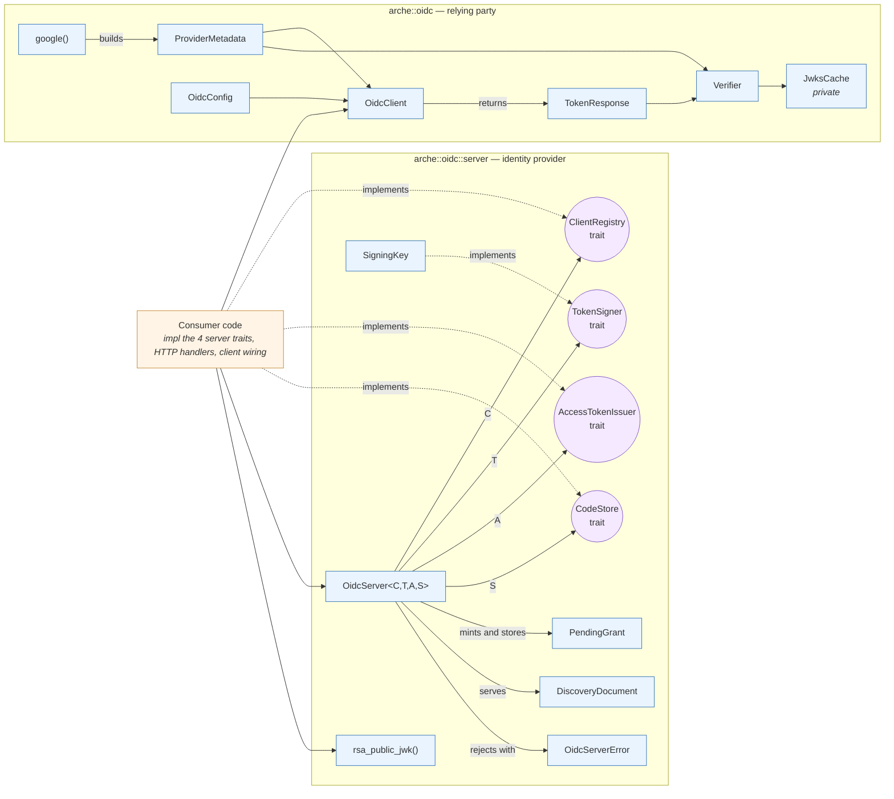

# Architecture

Two independent halves of one protocol:

1. **`arche::oidc` (client / relying party)** — build the authorize redirect,
   exchange the code for tokens, verify the ID token. Pure protocol logic over
   `reqwest`; you supply config and a `ProviderMetadata`.
2. **`arche::oidc::server` (identity provider)** — validate the authorize
   request, mint the single-use code, sign the ID token. arche owns the
   protocol; **you** own client resolution, code storage, token signing, and
   access-token minting via four traits.

Neither half imports the other in production code. The only cross-reference is
one `use` line inside a `#[cfg(test)]` interop test that drives the client
against the server over real HTTP — compatibility proven without shared code.

## Map

Hover any node for a one-line explanation (GitHub, VS Code, and mermaid.live
all render the tooltips).

### Legend

- **Oval nodes (`(( ))`)** — traits. The seams you plug into.
- **Purple-tinted** — trait definitions.
- **Blue-tinted** — concrete arche code (types, helpers, the built-in `SigningKey`).
- **Orange-tinted** — consumer code (out of this crate).

## The four server seams

`OidcServer` is generic over four traits. The asymmetry is deliberate — a
built-in exists only where it encodes *math*, never *policy*:

| Trait | Built-in | Why |
|---|---|---|
| `TokenSigner` | `SigningKey` (local RSA) | Correct RS256 signing + JWK derivation is math; a wrong hand-roll is a security bug. A local PEM is a legitimate production posture. |
| `ClientRegistry` | **none** | Where partner registrations live (static, DB, config service) is your policy. |
| `AccessTokenIssuer` | **none** | Whether the access token is opaque noise or a verifiable JWT is your policy. |
| `CodeStore` | **none** | Where codes persist (memory vs. Redis/PG) is your deployment policy — and single-instance vs. clustered is a correctness choice only you can make. |

`SigningKey` is also **custody-only**: arche assembles the JWT (header,
base64url, splice) inside `mint_id_token` and asks the signer only to *sign
these bytes*. That is what makes a Cloud KMS / HSM signer a ~15-line impl
rather than a JOSE project.

## Where each defense lives

| Defense | Enforced by | Where |
|---|---|---|
| Codes go only to registered URIs | `validate_authorize` + re-check in `issue_code`, against your registry | `server/mod.rs` |
| Unknown client / unregistered URI never redirect | validated first; `redirect_url` refuses non-redirectable errors | `server/mod.rs` + `types.rs` |
| PKCE mandatory, S256 only, challenge format-checked | `validate_authorize` / `issue_code` | `server/mod.rs` |
| `openid` scope required, tokens format-checked, narrowed to `allowed_scopes` | `validate_authorize` | `server/mod.rs` |
| Code single-use | atomic delete-on-read in `take` | your `CodeStore` |
| Code bound to client + redirect_uri; PKCE verifier matches | `exchange` vs. `PendingGrant`, `verify_pkce` | `server/mod.rs` |
| Client secret compared in constant time | default `verify_secret` / your override | `registry.rs` |
| Consumer claims can't forge protocol claims | `RESERVED_CLAIMS` strip in `mint_id_token` | `server/mod.rs` |
| `sub` bounded to 1–255 ASCII | `issue_code` | `server/mod.rs` |
| Issuer is https (loopback-http for dev only) | `OidcServer::new` | `server/mod.rs` |
| Signing-key custody | your `TokenSigner` — local PEM or KMS/HSM | `keys.rs` |

On the client side, the `Verifier` does the mirror job: RS256-only, `kid`
lookup against a rotation-aware JWKS cache, then `iss`/`aud`/`exp`/`iat`/`nbf`
with 60 s clock skew. Anything wrong with the token is a uniform
`AppError::Unauthorized` (real reason logged at debug); the provider being
unreachable is `AppError::DependencyFailed`.

## Not supported (deliberately, for now)

Refresh tokens, the client-credentials grant, and `/userinfo` (claims ride in
the ID token). Key rotation is *not* an arche limitation — it is a
`TokenSigner` implementation choice (serve several keys from `jwks()`, sign
with the newest).

## Next

- [sequence.md](sequence.md) — what a login looks like at runtime, both directions.
- [extending.md](extending.md) — run a client, stand up the server, implement the four traits.
