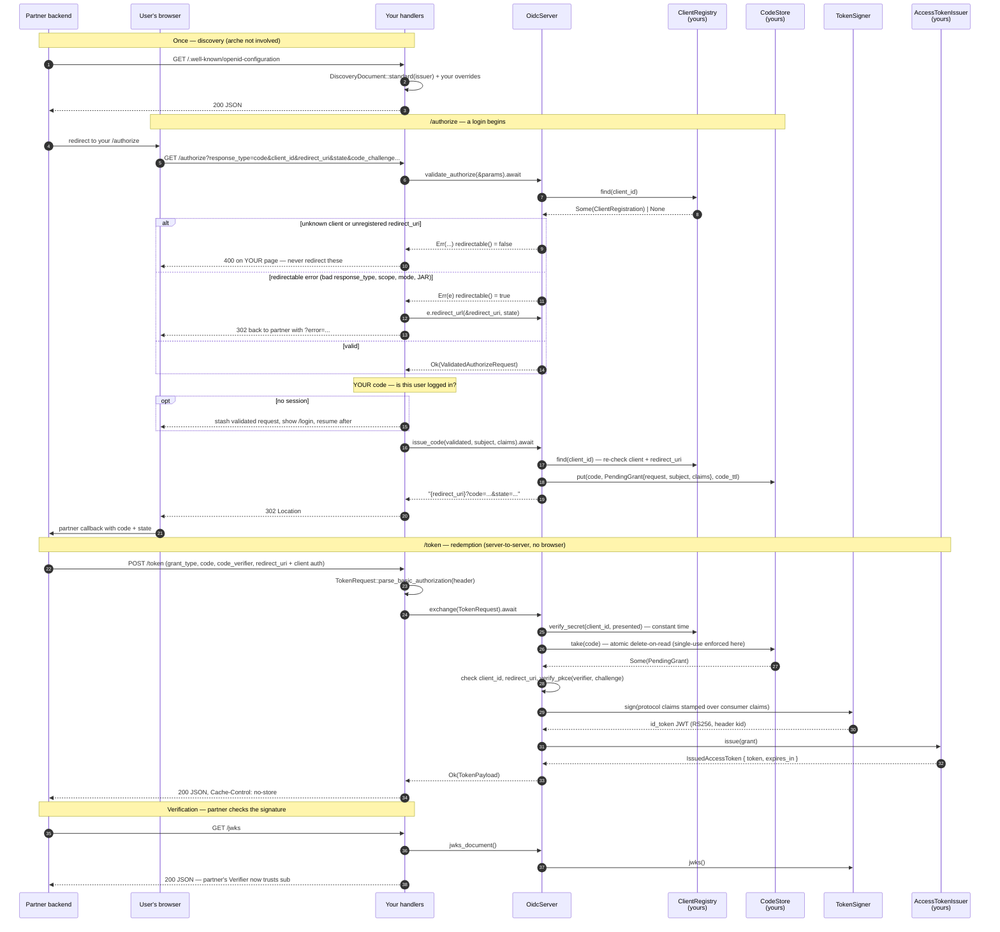
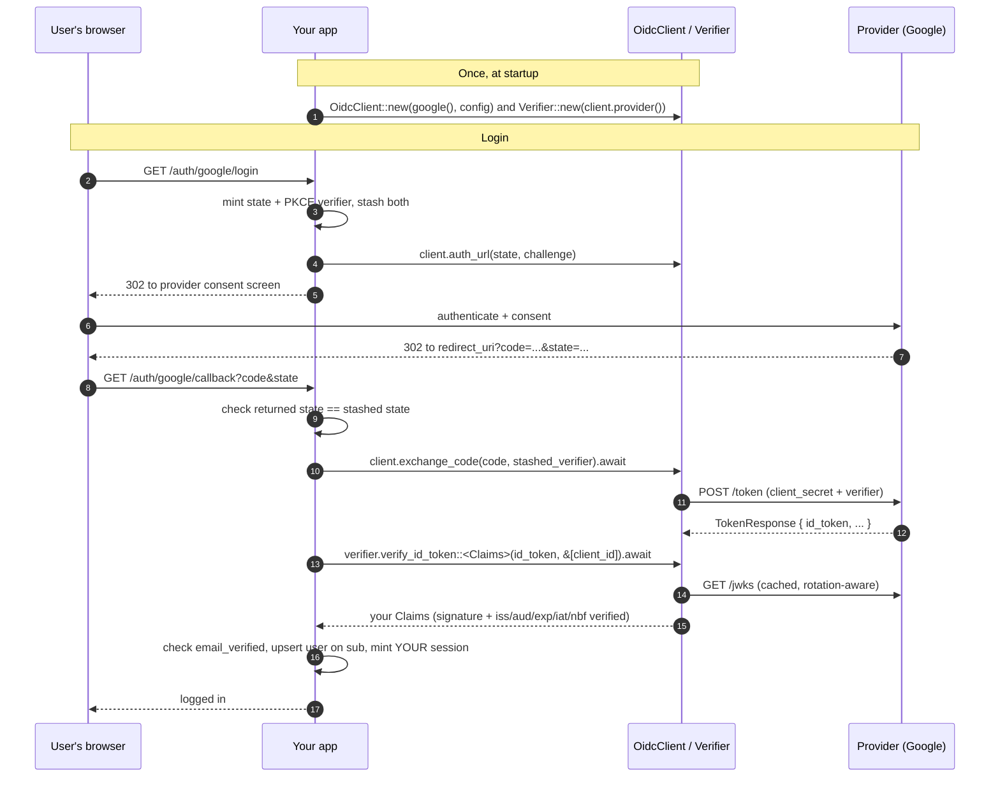

# Login Sequence

The authorization-code flow with PKCE, both directions. See
[architecture.md](architecture.md) for the static who-talks-to-whom.

## Serving logins (`arche::oidc::server`)

Partner app "shopfront" logs its users in via your identity provider. arche
does not run HTTP — you wire four routes, each calling one method.



## Logging in via someone else (`arche::oidc` client)

Your app is the relying party against Google (or any OIDC provider).



## Why state and PKCE

Two random per-login values arche threads through the flow (`auth_url(state,
challenge)` out, `exchange_code(code, verifier)` back). They defend opposite
substitution attacks — and both rest on the same fact: a browser's stash
(cookie/session) belongs to that browser alone; an attacker can forge the URL
but not the victim's stash.

- **`state`** — a CSRF token for the callback. Sent in two places at login: a
  cookie in the user's browser and the provider URL. The callback is legit
  only if the URL's `state` equals the stash's. Stops an attacker from feeding
  *their* login result into the victim's browser (their `state` won't match the
  victim's cookie).
- **PKCE** — `challenge = base64url(sha256(verifier))` rides the auth URL; the
  provider welds it onto the code. At exchange the backend reveals the
  `verifier`, which never entered any URL. Stops a *leaked code* from being
  redeemed by anyone else — the exchange demands the hash preimage, and only
  the flow that started the login has it. arche hardcodes S256 (no `plain`).

Rule of thumb: **state** stops the attacker's code landing in the victim's
session; **PKCE** stops the victim's code being redeemed in the attacker's
session.

## Refresh tokens (opt-in via `offline_access`)

Long-lived sessions without re-prompting. Off unless the granted scope
includes `offline_access` (operator adds it to `allowed_scopes`; your
`/authorize` handler decides whether to grant it).

```mermaid
sequenceDiagram
    autonumber
    participant RP as Partner backend
    participant S as OidcServer
    participant CS as CodeStore<br/>(yours)
    participant RS as RefreshTokenStore<br/>(yours)

    Note over RP,RS: First /token — code exchange with offline_access granted
    RP->>S: POST /token (grant_type=authorization_code, code, verifier)
    S->>CS: take(code) → grant (scope includes offline_access)
    S->>RS: put(refresh_token, grant, refresh_ttl)
    S-->>RP: { id_token, access_token, refresh_token }

    Note over RP,RS: Later /token — rotate
    RP->>S: POST /token (grant_type=refresh_token, refresh_token=RT₁ + client auth)
    S->>RS: take(RT₁) → grant   (RT₁ now GONE)
    S->>S: check grant.client_id == authenticated client; drop one-time nonce
    S->>RS: put(RT₂, grant, refresh_ttl)   (rotation)
    S-->>RP: { id_token (fresh), access_token (fresh), refresh_token=RT₂ }

    Note over RP,S: Replay of RT₁ → take() finds nothing → invalid_grant
```

The `take`-then-`put` is rotation: each refresh invalidates the previous
token and mints a new one. Because `take` is delete-on-read, a replayed
(already-rotated) token is rejected — the same single-use mechanic as
authorization codes. Claims are snapshotted at authorization; arche re-mints
them verbatim (minus `nonce`), as it has no user model to re-fetch.

## Error paths (server)

All redirectable errors flow back to the partner as `?error=<code>`; the two
non-redirectable ones must render on your page.

| `OidcServerError` | `error_code()` | Redirectable? | Your handler |
|---|---|---|---|
| `UnknownClient`, `UnregisteredRedirectUri` | `invalid_client` / `invalid_request` | **no** | 400 on your page |
| `UnsupportedResponseType`, `MissingPkce`, `Unsupported/MalformedChallenge`, `Malformed/MissingOpenidScope`, `UnsupportedResponseMode`, `Request(Uri)NotSupported` | per RFC | yes | 302 `e.redirect_url(uri, state)` |
| `AccessDenied`, `LoginRequired`, `InteractionRequired`, `ConsentRequired` | per RFC §3.1.2.6 | yes | 302 — construct these yourself when your login flow denies/needs auth |
| `InvalidClient`, `InvalidGrant`, `UnsupportedGrantType` (token endpoint) | `invalid_client` / `invalid_grant` / `unsupported_grant_type` | n/a | 400/401 JSON |
| `Internal(AppError)` | `server_error` | n/a | **5xx** — infra failure; the partner retries |

The `Internal(AppError)` split matters: a registry/store/signer outage returns
a 5xx a well-behaved RP will retry, not a 400 it would treat as permanent.

## What the client sees over the wire (token endpoint)

| | Value |
|---|---|
| Success | `200` + `TokenPayload` JSON, `Cache-Control: no-store` (OIDC §3.1.3.3) |
| `access_token` | whatever your `AccessTokenIssuer` minted |
| `id_token` | RS256 JWT: your claims + `iss`/`sub`/`aud`/`iat`/`exp` (+`nonce` if requested); `Debug` redacts it |
| Error | `400`/`401` + `{ "error": "<code>" }` |
